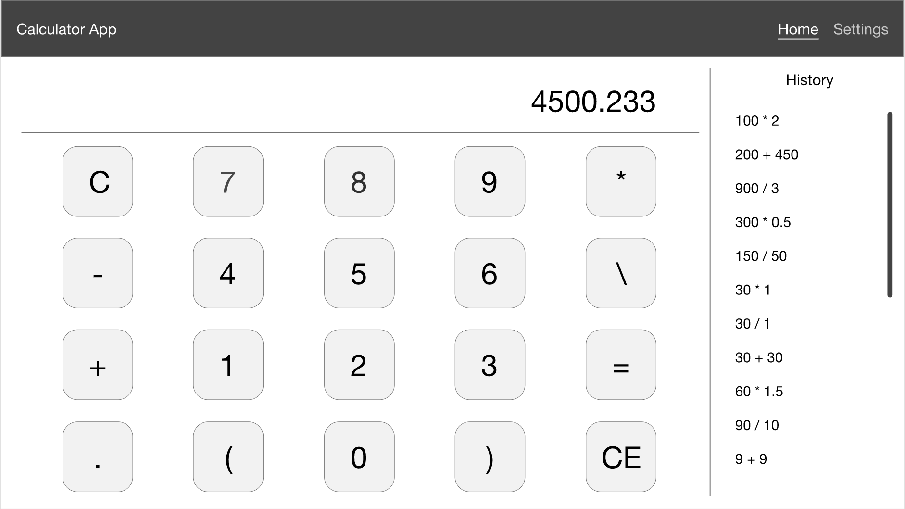
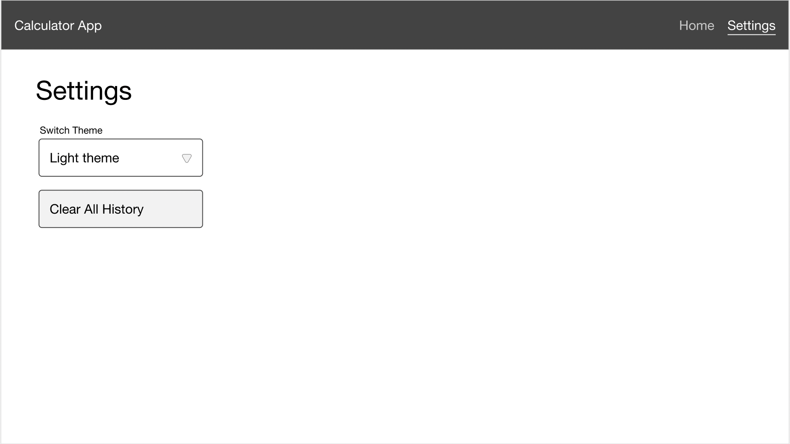
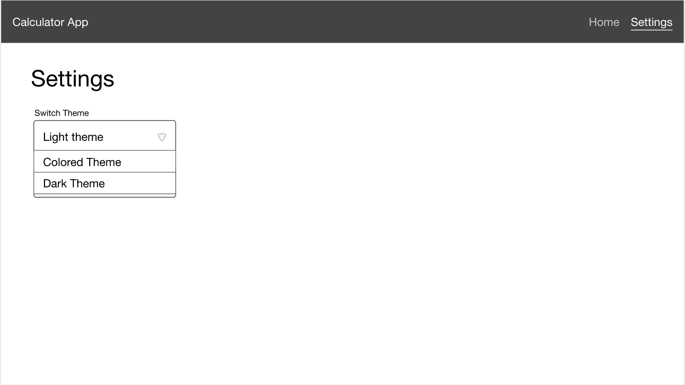

# Tестовое задание калькулятор

## Содержание

- [Техническое задание](#Техническое-задание)
- [Используемые технологии](#Используемые-технологии)
- [Структура проекта](#Структура-проекта)
- [Тестирование](#Тестирование)
- [Как начать](#Как-начать)
- [Полезные ссылки](#Полезные-ссылки)

## Техническое задание

Необходимо реализовать приложение калькулятор. Приложение должно предоставлять основные арифметические операции, построитель выражений и полную историю всех выражений.

**Обязательная компонентная модель:**

- **_Header_** - должен отображать заголовок приложения, а также ссылки на другие страницы.
- **_Calculator_** - корневой элемент для менеджмента данных калькулятора (логика для хранения истории, операций, текущего состояния и т.д.).
- **_Display_** - отображает ввод калькулятора, выражения и историю.
- **_History_** - отображает список ранее выполненных операций.
- **_ControlPanel_** - используется для управления взаимодействиями калькулятора, которые не связаны с расчетными операциями. Например, он предоставляет функции для переключения истории открытия и закрытия.
- **_Keypad_** - используется для ввода операндов, а также выполнения различных операций с этими операндами.

#### Диаграмма компонентов:

> 

#### Необходимый функционал:

- Сложение
- Вычитание
- Умножение
- Деление
- Переключение знака
- Построитель выражения
- История операций
- Показывать полную историю
- Очистка истории
- Очистка вычисленного значения и выражения
- Очистка всего (истории, вычисленного значения и выражения)
- Точность расчета - 3 символа

#### Дополнительный функционал

- Действительные числа могут быть записаны как 0.5 и .5
- Операция **%** - остаток от деления

#### Пример графического представления:

Ссылка на макет: [Макет "Калькулятор"](https://xd.adobe.com/view/3d64c8c6-a59f-4785-736f-6b50257b8e83-4b55/). Также макет можно найти в папке **doc** c расширением **.xd** для программы **Adobe XD**.

> 

> 

> 

#### Также проект предполагает:

- Организацию файловой структуры react приложения ([_см. Структура проекта_](#Структура-проекта)).
- Для реализации логики приложения, необходимо использовать поведенческий паттерн программирования **_"Команда"_**, который позволяет превращает запросы в объекты, позволяя передавать их как аргументы при вызове методов, ставить запросы в очередь, логировать их, а также поддерживать отмену операций (см. подробнее [паттерн Команда](https://refactoring.guru/ru/design-patterns/command)).
- Реализация с использованием как классовых, так и функциональных react компонентов и использованием хуков. Разделите приложение на две страницы, на одной из которых будет представлена реализация через классовые компоненты, а на второй - через функциональные.
- Обработку ошибок через паттерн _"Error Boundaries"_
- Реализация светлой и тёмной темы с использованием _styled-components_
- Проверку типов в React компонентах, передаваемых параметров и подобных объектов.
- Использование алиасов для импортирования файлов.

## Используемые технологии

### Для react-

- **_Babel_** - транспайлер, преобразующий код из одного стандарта в другой.
- **_Webpack_** - инструмент, позволяющий скомпилировать, например, JavaScript модули в единый JS-файл.
- **_yarn_** - менеджер пакетов.
- **_react_** - JavaScript-библиотека для создания пользовательских интерфейсов.
- **_react-router-dom_** - набор навигационных компонентов.
- **_react-redux_** - инструмент управления состоянием.
- **_styled-components_** - система стилизации react компонентов.

## Структура проекта

#### Пояснения к корневой папке:

- **_.vscode_** - папка для конфигурационных файлов **_VS CODE_**.
- **_node_modules_** - здесь будут находится пакеты, установленные **_NPM_** или **_Yarn_**.
- **_public_** - место, где находятся ваши статические файлы (например **_index.html_**, **_manifest.json_**).
- **_src_** - место, где находятся ваши динамические файлы (исходный код вашего приложения). Также в корневой папке находятся все конфигурационные файлы вашего приложения.

#### Пояснение для структуры файлов компонента:

- **_index.js_** - корневой файл для экспорта компонентов.
- **_\*.jsx_** - компоненты модуля (может быть несколько).
- **_conponents.js_** - стилизованные компоненты с использование **_stylde-components_**.

## Тестирование

Реализовать e2e тестирование c полным покрытием функционала приложения:

- Арифметические операции.
- Модуль истории.
- Модуль дисплея.
- Модуль клавиатуры.
- Модуль навигации.
- Модуль смены темы и т.д.

